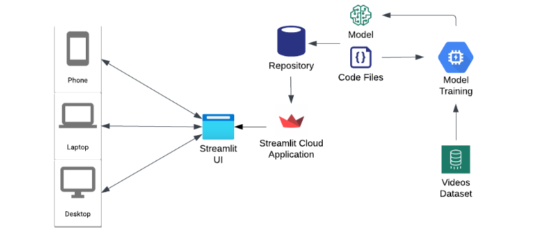

# DeepLens

The emergence of synthetic media manipulations, particularly those generated by sophisticated GANs, poses a significant challenge to the integrity of digital content, enabling the creation
of highly realistic yet fabricated representations of individuals. These pose a threat to personal privacy, public trust, and even national security. 

While advanced deep-learning methods are proficient in replicating visual features, they falter in accurately simulating biological markers, such as the subtle changes in skin tone 
caused by blood flow. `DeepLens` is a platform to classify synthetical manipulations in facial videos by capitalizing on this vulnerability. It also offers video forensics like frame-by-frame
analysis and color channel analysis.

.png)

## 🎬 Features

1. `Facial Manipulation Detection`: Determine the originality of your content, differentiating the real from the altered.

  .png)

2. `Frame-by-Frame Analysis`: Dive into every detail of each frame, uncovering hidden patterns and insights.

  .png)
   
3. `Color Channel Analysis`: Explore the nuances of colour variations and their impact on your video's storytelling.

  .png)

## 📝 Methodology and Algorithms Used 

### Photoplethysmographic Maps Creation Workflow
This pipeline transforms raw video data into analysable maps using a combination of facial landmark detection, ROI extraction, and colour space transformation
, which our deep learning model then uses as input to differentiate between real and deepfake videos.

1. `Initializing Video Processing`: The function begins by defining the video path and using OpenCV to open and read the video file.
2. `Frame Analysis Setup`: It retrieves the frames per second (fps) and the total frame count from the video, setting the number of frames per segment to 128.
3. `Face Detection and Landmark Prediction`: Utilizing dlib's face detector and shape predictor, the function identifies facial landmarks in each frame, focusing on the nose area to establish a region of interest (ROI).
4. `ROI Processing`: The ROI around the nose is defined and extracted from each frame. This area is crucial for analysing subtle colour changes related to blood flow and is essential for creating photoplethysmographic (PPG) maps.
5. `Subregion Analysis and Filtering`: The ROI is divided into subregions. Each subregion is converted into different colour spaces (YCrCb and HSV), and Gabor filtering is applied to each layer (Y, V, R, B, G) to extract relevant features.
6. `Feature Aggregation`: The mean values of filtered layers in each subregion are computed and stored in an array, forming the raw data for the PPG map.
7. `Segment Processing and Saving`: Once a segment (128 frames) is processed, the PPG map for that segment is scaled and saved as an image. The function then resets for the next segment until all frames in the video are processed.

### Depthwise Separable CNN Model
Following is a breakdown of the model's architecture and components:

1. `Optimizer`: A custom Adam optimiser with a learning rate of 0.0005 is defined.
2. `Model Architecture`: Keras’ Sequential API indicates that layers are stacked linearly.
3. `Depthwise Separable Convolution Layers`:
    - The first layer is a depthwise separable convolution layer (`DepthwiseConv2D`). This type of layer performs depthwise spatial convolution followed by a pointwise convolution, reducing the number of parameters compared to a standard convolution and making the model more efficient.
    - The `SeparableConv2D` layers are used to refine the feature maps further. These layers are known for their efficiency in handling high-dimensional inputs like images.
4. `Batch Normalization`: After each convolutional layer, these are added. These BatchNormalization layers normalise the output from the previous layer, which helps speed up training and reduces the sensitivity to network initialisation.
5. `MaxPooling Layers`: MaxPooling2D Layers reduce the input volume's spatial dimensions (width, height) for each feature map. This operation helps in reducing computational load and overfitting.
6. `Flatten and Dense Layers`:
    - The flattening layer (Flatten) converts the 2D feature maps into a 1D feature vector, which is then passed to the dense layers.
    - The dense layers (Dense) include a hidden layer with 128 units and ReLU activation, followed by a dropout layer (Droupout) with a rate of 0.5 to prevent overfitting.
    - The final dense layer has a single unit with a sigmoid activation function, suitable for binary classification (real vs. manipulated).
7. `Model Compilation`: The model is compiled using the custom optimiser, binary cross-entropy as the loss function, i.e. `f(BCE)` (appropriate for binary classification tasks), and accuracy as the performance metric.
8. `Model Training`: Training is done in batches of 32, for up to 80 epochs with an early stopping callback (patience: 10 epochs, min_delta: 0.001).

### Project Deployment
The UI for our project was developed using Streamlit and designed to be user-friendly, enabling users to easily upload videos and also intuitively present the results. Upon successfully training our model on the dataset, 
we created a model file that encapsulates all the learned parameters and weights. Alongside the model file, all necessary code files, including scripts for data processing, model inference, and other utilities, were prepared for 
deployment and were pushed to our project's Git repository.
This repo acts as a central hub for all the deployment-ready components of our project. For deployment, we utilised Streamlit Cloud, which provided a straightforward deployment process, allowing us to deploy our application 
directly from our Git repo. This platform ensured that our application was accessible to users with a dedicated URL.

## 👥 Contributors

<table>
  <tr>
    <td align="center"><a href="https://github.com/abhishek-x"> <b>Abhishek Aggarwal</b></a> </td>
  </tr>
</table>
